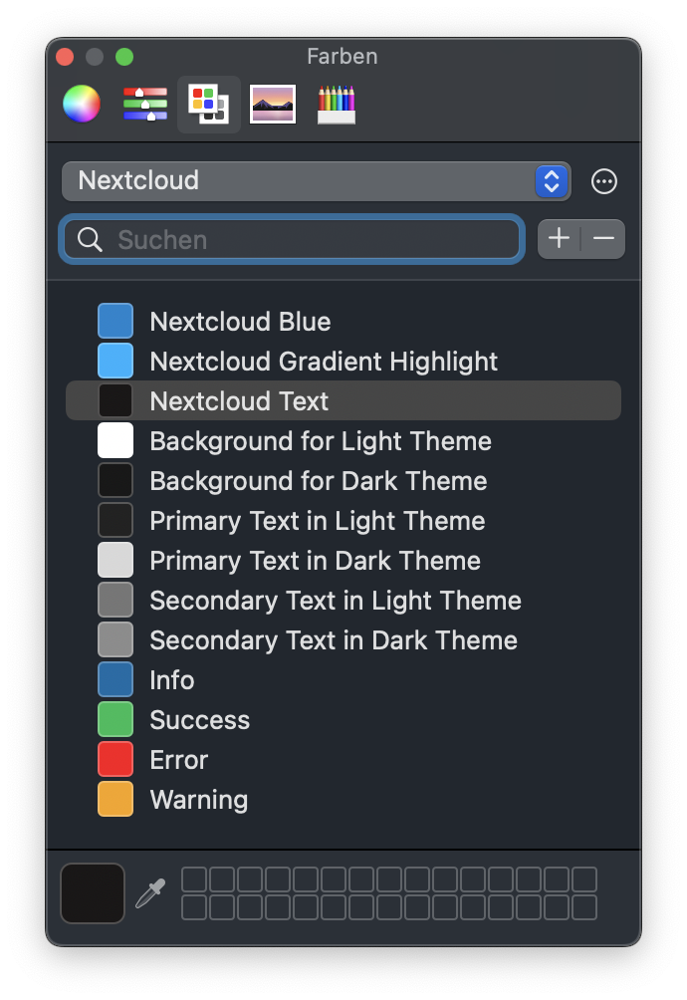

# Nextcloud Color Palette

[Nextcloud brand colors](https://nextcloud.com/brand/#colors) as a macOS color palette so you do not have to pull up the brand guidelines every time.

## Installation

### Easy

The simplest way is to download the `Nextcloud.clr` file and place it into `~/Library/Colors`.
The problem: You have to check for updated manually from time to time and maybe do that again.

### Advanced

1. Clone this repository to wherever you like.
2. Create a symbolic link in `~/Library/Colors` to the working tree of your repository clone, more specifically the `Nextcloud.clr` file with `ln -s /path/to/clone/Nextcloud.clr`.